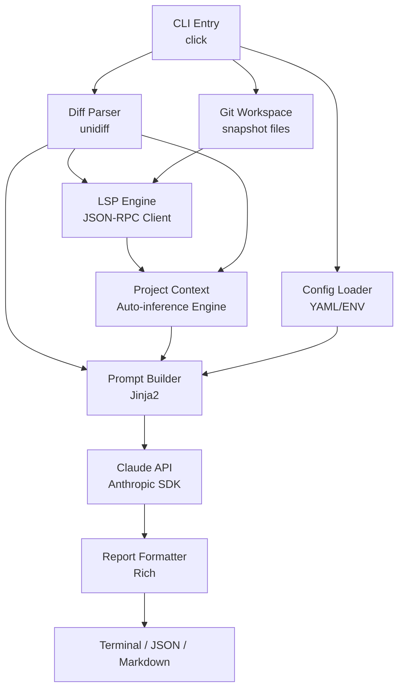

# 智能代码审查 Agent — Architecture Design Document

> **Version**: v3.3 | **Created**: 2026-05-25 | **Status**: Complete — all 11 nodes passed

## 1. Project Overview

### 1.1 Core Objective

MyGO 是一个 CLI 驱动的智能代码审查 Agent。开发者传入一个 git diff，Agent 自动执行三阶段分析：

1. **感知阶段**：解析 diff → LSP 语义查询（定义、引用、类型、诊断）→ 自动推断项目上下文
2. **推理阶段**：将 diff + LSP 语义 + 项目上下文组装为 prompt，调用 LLM API（支持 Anthropic / OpenAI / DeepSeek / 通义千问 / Kimi / GLM 等多厂商）
3. **输出阶段**：生成结构化审查报告

与纯 LLM 审查工具的决定性区别：

- **有语义理解**：通过 LSP 知道"这个函数被谁调用、定义在哪、类型是什么"，不是只看 diff 文本
- **有项目认知**：自动扫描项目结构推断意图，后续每次审查增量更新——开发者零配置
- **有边界约束**：知道什么不该管（需求完整性），只聚焦代码质量

### 1.2 Target Users / Use Cases

| 用户 | 场景 |
|------|------|
| 个人开发者 | commit 前自查：`git diff | mygo review -` |
| 面试展示 | Agent 架构、LSP 协议、项目意图推断、Prompt Engineering |
| 小团队 TL | PR 预筛，人工只审高风险变更 |
| 开源维护者 | 社区 PR 首轮自动审查 |

### 1.3 Success Metrics

- 审查报告覆盖 ≥4 个维度（安全、性能、逻辑、可维护性）
- 100 行以内 diff 的端到端响应 <15 秒
- Agent 发现的问题中 ≥60% 被人工认可
- 支持 ≥3 种编程语言（Python、TypeScript、Go）
- 开发者零配置即可获得项目感知能力（无需手写 project.yaml）

### 1.4 Key Highlights / Differentiators

- **多厂商 LLM 支持**：Anthropic、OpenAI、DeepSeek、通义千问、Kimi、GLM 一键切换——OpenAI 兼容系一个后端覆盖五家厂商
- **LSP 语义感知**：自实现 JSON-RPC 客户端，对变更符号查询定义/引用/类型/诊断
- **项目上下文自动推断**：首次运行时扫描项目结构，后续增量更新——零配置
- **审查边界约束**：system prompt 明确禁止越界（不推测缺失功能、不做需求评审）
- **纯 CLI 工具**：直接对接 git workflow，`git diff | mygo review -` 即用
- **结构化输出**：JSON + 终端美化 + Markdown 三种格式

---

## 2. Architecture Design

### 2.1 System Architecture



### 2.2 Core Data Flow

```
用户: mygo review staged
    │
    ▼
1. CLI 解析参数 → git diff --staged → 原始 diff 文本
    │
    ▼
2. Diff Parser → DiffFile[] (结构化：哪些文件、哪些行被改、语言)
    │
    ▼
3. Git Workspace → 提取变更文件的完整内容
    │
    ▼
4. LSP Engine → 对变更位置的符号查询 definition/references/hover/diagnostics
    → 输出 SemanticContext
    │
    ▼
5. Project Context Engine:
   - 首次: 扫描项目结构 → 推断模块/接口/模式 → 写入 .mygo/context.yaml
   - 后续: 根据本次 diff 增量更新 context.yaml
   - 注入到 prompt 时: 只提取"与本次变更相关的模块和接口"
    │
    ▼
6. Prompt Builder 组装三段式 prompt:
   - System: 角色设定 + 审查边界约束 + 输出 JSON schema
   - 项目上下文: 相关模块/接口/模式（来自 context.yaml）
   - User: diff 全文 + LSP 语义摘要
    │
    ▼
7. LLM Client → Claude API (流式)
    │
    ▼
8. Report Formatter → 终端/JSON/Markdown
```

### 2.3 Module / Component Breakdown

| 模块 | 文件 | 职责 | 依赖 |
|------|------|------|------|
| CLI | `mygo/cli.py` | 参数解析，子命令路由，管线编排 | 所有模块 |
| Config | `mygo/config.py` | 读配置、环境变量、CLI 参数合并 | 无 |
| Models | `mygo/models.py` | 所有数据类定义 | 无 |
| Diff Parser | `mygo/diff_parser.py` | unified diff → DiffFile[] | models |
| Git Workspace | `mygo/git_workspace.py` | 提取变更文件完整内容 | models |
| LSP Client | `mygo/lsp/client.py` | JSON-RPC 客户端，启停语言服务器 | models |
| LSP Engine | `mygo/lsp/engine.py` | 编排 LSP 查询 → SemanticContext | lsp.client |
| LSP Lang Configs | `mygo/lsp/lang_*.py` | 各语言的 server 路径和 init 参数 | lsp.client |
| **Project Context** | **`mygo/context.py`** | **自动推断项目意图，增量更新** | **models, git_workspace** |
| Prompt Builder | `mygo/prompt.py` | 三段式 prompt 组装 | models, config, context |
| LLM Client | `mygo/llm.py` | Anthropic SDK 封装，流式/同步，重试 | config |
| Report Formatter | `mygo/formatter.py` | LLM 响应 → Report → 终端/JSON/MD | models |

### 2.4 Data Models

```python
# ==================== Diff Models ====================

@dataclass
class DiffHunk:
    old_start: int
    old_lines: int
    new_start: int
    new_lines: int
    header: str
    lines: list[str]

@dataclass
class DiffFile:
    filename: str
    old_filename: str | None
    hunks: list[DiffHunk]
    language: str
    changed_lines: list[int]    # new-file lines that were added/modified

# ==================== LSP Semantic Models ====================

@dataclass
class SymbolLocation:
    uri: str
    line: int
    character: int
    text: str

@dataclass
class ChangedSymbol:
    name: str
    kind: str                     # function | class | variable | method | type
    change_type: str              # added | modified | removed
    file: str
    line: int
    definition: SymbolLocation | None
    references: list[SymbolLocation]    # max 20
    hover_info: str | None
    diagnostics: list[str]

@dataclass
class SemanticContext:
    symbols: list[ChangedSymbol]
    file_diagnostics: dict[str, list[str]]

# ==================== Project Context Models ====================

@dataclass
class ModuleInfo:
    """自动推断的单个模块信息"""
    name: str                     # 模块名，从目录/filename 推断
    path: str                     # 相对于项目根目录的路径
    role: str                     # 推断的角色描述
    public_symbols: list[str]     # 对外暴露的类/函数名

@dataclass
class InterfaceInfo:
    """自动推断的关键接口"""
    name: str                     # 函数/类名
    file: str
    signature: str                # 简化签名
    role: str                     # 推断的角色

@dataclass
class ProjectContext:
    """自动推断的项目全局上下文"""
    inferred_domain: str          # 推测领域，如 "卡牌游戏" | "无法确定"
    language: str
    framework: str                # 如 "pygame" | "fastapi" | "unknown"
    modules: list[ModuleInfo]
    entry_points: list[str]       # 入口文件
    key_interfaces: list[InterfaceInfo]
    patterns_detected: list[str]  # 检测到的设计模式
    last_updated: str             # ISO timestamp

# ==================== Report Models ====================

@dataclass
class Finding:
    severity: Literal["critical", "major", "minor", "suggestion"]
    category: Literal["security", "bug", "performance", "maintainability", "style"]
    file: str
    line: int | None
    title: str
    description: str
    suggestion: str | None

@dataclass
class ReportMetadata:
    model: str
    tokens_used: int
    duration_ms: int
    files_reviewed: int
    lsp_symbols_queried: int
    context_modules_matched: int   # 本次审查匹配到的相关模块数

@dataclass
class Report:
    summary: str
    findings: list[Finding]
    score: int
    metadata: ReportMetadata
```

### 2.5 API / Interface Contracts

#### 2.5.1 CLI Interface

```
mygo review [OPTIONS] [DIFF_SOURCE]

Arguments:
  DIFF_SOURCE    diff 来源: 文件路径 | "-" (stdin) | "staged" | "HEAD~n" (默认: staged)

Options:
  -l, --language TEXT      目标语言 (auto 自动检测)
  -c, --config PATH        配置文件路径 (默认: .mygo.yaml)
  -o, --output TYPE        输出格式: terminal | json | markdown (默认: terminal)
  --categories TEXT        审查类别，逗号分隔 (默认: all)
  --model TEXT             Claude 模型 (默认: claude-sonnet-4-6)
  --max-tokens INT         最大 token 数 (默认: 4096)
  --no-lsp                 禁用 LSP 语义分析（纯文本审查）
  --no-context             禁用项目上下文注入（纯 diff 审查）
  --no-stream              禁用流式输出
  --timeout INT            API 超时秒数 (默认: 60)
  --lsp-timeout INT        LSP 查询超时秒数 (默认: 10)
```

#### 2.5.2 Project Context Engine Internal API

```python
class ProjectContextEngine:
    """自动推断和维护项目上下文"""

    def load_or_infer(self, project_root: str) -> ProjectContext:
        """
        1. 检查 .mygo/context.yaml 是否存在
        2. 存在且未过期(7天内) → 直接加载
        3. 不存在或已过期 → 全量扫描推断
        """

    def update_from_diff(self, ctx: ProjectContext, diff_files: list[DiffFile],
                         files_content: dict[str, str]) -> ProjectContext:
        """
        增量更新：
        - 新文件 → 分析角色 → 加入 modules
        - 新接口/抽象类 → 加入 key_interfaces
        - 新 import 关系 → 更新模块间关系
        - 无变更 → 零开销返回
        """

    def to_prompt_snippet(self, ctx: ProjectContext, diff_files: list[DiffFile]) -> str:
        """
        从完整上下文中提取与本次 diff 相关的部分，
        格式化为 prompt 可注入的文本段落。
        无关模块自动裁剪，控制 token 开销。
        """
```

#### 2.5.3 Supported Language Servers

| Language | Server | Binary | Install |
|----------|--------|--------|---------|
| Python | Pyright | `pyright-langserver` | `npm i -g pyright` |
| TypeScript | TypeScript Server | `typescript-language-server` | `npm i -g typescript-language-server typescript` |
| Go | gopls | `gopls` | `go install golang.org/x/tools/gopls@latest` |

---

## 3. Technology Stack

| Layer | Technology | Version | Rationale |
|-------|-----------|---------|-----------|
| Language | Python | ≥3.11 | Anthropic SDK 最佳支持；asyncio 适合 LSP IO；类型注解现代化 |
| CLI | click | ≥8.x | 装饰器风格简洁，子命令扩展方便 |
| Diff Parse | unidiff | ≥0.7 | 最成熟的 unified diff Python 解析库 |
| LSP | 自实现 (asyncio subprocess + json) | — | 只实现 5 个 method，面试可讲协议栈细节 |
| LLM SDK (Anthropic) | anthropic | ≥0.40 | Anthropic 官方 SDK，stream/thinking 支持 |
| LLM SDK (OpenAI 兼容) | openai | ≥1.0 | OpenAI 官方 SDK，同时兼容 DeepSeek/Qwen/Kimi/GLM 等（仅需改 base_url） |
| LLM SDK (Google) | google-generativeai | ≥0.8 | Google 官方 SDK，用于 Gemini 系列模型 |
| Prompt Template | Jinja2 | ≥3.x | 三段式 prompt 需要条件渲染 |
| Terminal Output | rich | ≥13.x | Panel / Table / Markdown / Spinner |
| Config | PyYAML | ≥6.x | YAML 是配置文件事实标准 |
| Testing | pytest + pytest-asyncio + pytest-mock | latest | 标准栈 + asyncio + mock |
| Package | setuptools + pyproject.toml | — | 标准 Python 打包 |

---

## 4. Development Node Plan

### 4.1 Node Overview (Tree)

```
0.1 项目脚手架 (scaffold)
 │
 └─► 0.2 数据模型 (models)
      │
      ├─► 0.3 Diff 解析 (diff parser)
      │
      ├─► 0.4 Git 工作区快照 (git workspace)
      │    │
      │    └─► 0.5 LSP 语义引擎 (lsp engine)
      │
      ├─► 0.6 LLM 客户端 (llm client)
      │
      ├─► 0.7 项目上下文引擎 (context engine)
      │
      ├─► 0.8 Prompt 构建 (prompt builder)
      │
      ├─► 0.9 CLI + 报告输出 (cli + formatter)
      │    │
      │    └─► 0.10 端到端集成 (e2e integration)
      │
      └─► 0.11 Git Pre-commit Hook (agent integration)
```

**并行开发说明**：0.3, 0.4+0.5, 0.6, 0.7 均只依赖 0.2，可以并行开发。0.8 依赖 0.3/0.5/0.7，是第一个汇聚点。0.9 是最终汇聚点。0.11 依赖 0.9 的所有功能（CLI + JSON output + review pipeline）。

### 4.2 Detailed Node Specifications

#### Node 0.1 — 项目脚手架

- **Node ID**: 0.1
- **Name**: 项目脚手架
- **Goal**: 建立项目基础结构，`pip install -e .` 可运行
- **Scope**:
  - `pyproject.toml` — 项目元数据、所有依赖（含 future 依赖，预先声明）、entry point `mygo`
  - `mygo/__init__.py` — `__version__ = "0.1.0"`
  - `mygo/cli.py` — click 骨架：`main()` group + `review` 子命令（placeholder）
  - `mygo/lsp/__init__.py` — LSP 子包标记
  - `.mygo.yaml` — 默认配置（model, max_tokens, categories, lsp, context, output）
  - `.gitignore` — Python 标准忽略 + `.mygo/context.yaml`
- **Acceptance Criteria**:
  - `pip install -e .` 无报错
  - `mygo --help` 显示可用命令
  - `mygo --version` 显示版本号
  - `mygo review` 打印 placeholder 并 exit 0
  - `.mygo.yaml` 包含所有配置段（model, max_tokens, categories, lsp, context, output）
  - `.gitignore` 覆盖 Python 常见忽略项 + `.mygo/`
- **Dependencies**: 无
- **Estimated Effort**: Small

### Review — 0.1
- **Date**: 2026-05-25
- **Result**: BLOCKERS: 1 (fixed), CRITICAL: 2 (1 environmental, 1 deferred), WARNINGS: 2 (fixed), SUGGESTIONS: 5
- **Verdict**: PASS WITH FIXES — BLOCKER fixed (wrong output string); W1 (.gitignore) and W3 (empty lsp/__init__.py) fixed; C2 (provider list dedup) deferred to Node 0.6 when provider registry module is created; C1 (pip install verification) blocked by Windows Store Python stub in current shell
- **Key findings**: Acceptance criterion #2 had a wording mismatch — placeholder output format was inconsistent with spec; .gitignore was missing *.egg, *.so, coverage artifacts, .python-version

---

#### Node 0.2 — 数据模型定义

- **Node ID**: 0.2
- **Name**: 数据模型定义
- **Goal**: 定义所有 dataclass，是整个项目的类型基石
- **Scope**:
  - `mygo/models.py`:
    - DiffHunk, DiffFile（diff 结构化）
    - SymbolLocation, ChangedSymbol, SemanticContext（LSP 语义）
    - ModuleInfo, InterfaceInfo, ProjectContext（项目上下文）
    - Finding, ReportMetadata, Report（审查报告）
  - `to_dict()` / `from_dict()` 序列化方法
  - Finding.severity 和 category 使用 Literal 类型约束
- **Acceptance Criteria**:
  - 所有模型正常实例化
  - `Report.to_dict()` / `Report.from_dict()` 往返不丢数据
  - Literal 类型非法值时 mypy/pyright 报错
  - `python -c "from mygo.models import *; print('ok')"` 成功
- **Dependencies**: 无
- **Estimated Effort**: Small

### Review — 0.2
- **Date**: 2026-05-25
- **Result**: BLOCKERS: 0, CRITICAL: 2 (fixed), WARNINGS: 5, SUGGESTIONS: 5
- **Verdict**: PASS WITH FIXES — CRITICAL items fixed (unused helper, unused imports); WARNING items are design tradeoffs for MVP
- **Key findings**: 11 models verified via round-trip serialization tests; deep nesting survives correctly

---

#### Node 0.3 — Diff 解析模块

- **Node ID**: 0.3
- **Name**: Diff 解析模块
- **Goal**: unified diff 文本 → DiffFile 对象列表
- **Scope**:
  - `mygo/diff_parser.py`:
    - `parse_diff(diff_text: str) -> list[DiffFile]`
    - 依赖 unidiff 库
    - 自动检测语言（扩展名映射）
    - 计算 changed_lines（新增/修改行的行号）
    - malformed diff → 空列表，不抛异常
- **Acceptance Criteria**:
  - `parse_diff("")` → `[]`
  - 新增(old=None)、删除(new=None)、重命名(old≠new) 解析正确
  - changed_lines 准确
  - 语言检测：.py→python, .ts/.tsx→typescript, .go→go, .js→javascript
  - 单元测试覆盖率 ≥90%
- **Dependencies**: 0.2 (DiffFile, DiffHunk)
- **Estimated Effort**: Medium

---

#### Node 0.4 — Git 工作区快照

- **Node ID**: 0.4
- **Name**: Git 工作区快照
- **Goal**: 从 git 仓库提取变更文件完整内容，供 LSP 和 Context Engine 使用
- **Scope**:
  - `mygo/git_workspace.py`:
    - `find_repo_root() -> str | None` — 向上查找 .git
    - `get_changed_files_content(diff_files, repo_root) -> dict[str, str]` — 文件名→完整源码
    - `get_project_file_list(repo_root) -> list[str]` — 项目所有源文件列表（供 context 扫描用）
- **Acceptance Criteria**:
  - 新增/修改/删除文件的完整内容正确获取
  - 非 git 环境返回合理错误
  - 单元测试覆盖
- **Dependencies**: 0.2 (DiffFile)
- **Estimated Effort**: Small

---

#### Node 0.5 — LSP 语义引擎

- **Node ID**: 0.5
- **Name**: LSP 语义引擎
- **Goal**: 自实现最小可用的 LSP JSON-RPC 客户端，对变更符号查询语义信息
- **Scope**:
  - `mygo/lsp/client.py` — `LSPClient` 类:
    - asyncio subprocess 启动/停止语言服务器
    - JSON-RPC 2.0 消息编解码（Content-Length header + JSON body）
    - 实现 5 个 methods: `initialize`, `textDocument/didOpen`, `textDocument/definition`, `textDocument/references`, `textDocument/hover`
    - 消息 ID 管理、请求-响应匹配、超时保护
  - `mygo/lsp/engine.py` — `LSPEngine` 类:
    - `analyze(diff_files, files_content, workspace_root) -> SemanticContext`
    - 遍历变更行提取符号名（简易正则 + LSP hover 交叉验证）
    - 批量查询、去重、引用数上限 20
  - `mygo/lsp/lang_python.py` / `lang_typescript.py` / `lang_go.py`
- **Acceptance Criteria**:
  - 成功启动 pyright-langserver，完成 initialize + didOpen
  - definition 返回正确位置
  - references 返回引用列表
  - LSP 单个查询超时 10s 抛 LSPTimeoutError
  - Language Server 进程在 shutdown 时终止
  - Mock LSP server 的单元测试覆盖正常/异常路径
- **Dependencies**: 0.2 (SemanticContext 等), 0.4 (文件内容)
- **Estimated Effort**: Large

---

#### Node 0.6 — LLM 客户端模块（多厂商支持）

- **Node ID**: 0.6
- **Name**: LLM 客户端模块
- **Goal**: 封装多厂商 LLM 调用，统一接口，调用者无需关心底层是 Anthropic 还是 OpenAI 兼容系
- **Scope**:
  - `mygo/llm/__init__.py` — 统一导出 `CodeReviewer`
  - `mygo/llm/base.py` — `BaseBackend` 抽象基类，定义 `review(system, user, model, max_tokens, stream, timeout) -> str` 和 `review_stream(...) -> AsyncGenerator` 接口
  - `mygo/llm/anthropic.py` — `AnthropicBackend`，封装 `anthropic` SDK
  - `mygo/llm/openai_compat.py` — `OpenAICompatBackend`，封装 `openai` SDK，通过 `base_url` + `api_key` 同时覆盖 OpenAI / DeepSeek / 通义千问 / Kimi / GLM
  - `mygo/llm/gemini.py` — `GeminiBackend`，封装 `google-generativeai` SDK
  - `mygo/llm/provider.py` — 厂商预设注册表，包含每个厂商的 base_url、默认模型、环境变量名
  - `mygo/llm/exceptions.py` — `ConfigError`（缺 key）、`APIError`（网络/超时/服务端错误）
- **后端抽象设计**:
  ```
  CodeReviewer（门面）
     │
     ├──> AnthropicBackend（anthropic SDK）
     │     system prompt → system 字段
     │     user prompt   → messages[0]
     │
     ├──> OpenAICompatBackend（openai SDK）
     │     system prompt → messages[0].role="system"
     │     user prompt   → messages[1].role="user"
     │     base_url      → 切换厂商（openai.com / api.deepseek.com / dashscope.aliyuncs.com / api.moonshot.cn / open.bigmodel.cn）
     │
     └──> GeminiBackend（google-genai SDK）
           system prompt → config.system_instruction
           user prompt   → contents[0]
  ```
- **厂商预设表**:
  ```python
  PROVIDERS = {
      "anthropic": {
          "backend": "anthropic",
          "default_model": "claude-sonnet-4-6",
          "api_key_env": "ANTHROPIC_API_KEY",
      },
      "openai": {
          "backend": "openai_compat",
          "base_url": "https://api.openai.com/v1",
          "default_model": "gpt-4o",
          "api_key_env": "OPENAI_API_KEY",
      },
      "deepseek": {
          "backend": "openai_compat",
          "base_url": "https://api.deepseek.com/v1",
          "default_model": "deepseek-chat",
          "api_key_env": "DEEPSEEK_API_KEY",
      },
      "qwen": {
          "backend": "openai_compat",
          "base_url": "https://dashscope.aliyuncs.com/compatible-mode/v1",
          "default_model": "qwen-max",
          "api_key_env": "DASHSCOPE_API_KEY",
      },
      "kimi": {
          "backend": "openai_compat",
          "base_url": "https://api.moonshot.cn/v1",
          "default_model": "moonshot-v1-8k",
          "api_key_env": "MOONSHOT_API_KEY",
      },
      "glm": {
          "backend": "openai_compat",
          "base_url": "https://open.bigmodel.cn/api/paas/v4",
          "default_model": "glm-4",
          "api_key_env": "ZHIPUAI_API_KEY",
      },
      "gemini": {
          "backend": "gemini",
          "default_model": "gemini-2.5-flash",
          "api_key_env": "GOOGLE_API_KEY",
      },
  }
  ```
- **Acceptance Criteria**:
  - `CodeReviewer(provider="anthropic")` → 内部使用 AnthropicBackend
  - `CodeReviewer(provider="deepseek")` → 内部使用 OpenAICompatBackend，base_url 指向 DeepSeek
  - `CodeReviewer(provider="qwen")` → 内部使用 OpenAICompatBackend，base_url 指向 DashScope
  - `CodeReviewer(provider="gemini")` → 内部使用 GeminiBackend
  - 用户自定义 provider（自建 API 网关/代理）：`CodeReviewer(provider="custom", base_url="...", api_key="...")`
  - 缺 API key → `ConfigError`（提示正确的环境变量名，如 GOOGLE_API_KEY）
  - 网络错误重试 3 次，全失败抛 `APIError`
  - 401 不重试（key 无效，重试也无效）
  - 同步模式返回完整文本，流式模式逐 token yield
  - Mock 测试覆盖三个后端各自的正常/异常路径
- **Dependencies**: 0.2 (间接)
- **Estimated Effort**: Medium

### Review — 0.6
- **Date**: 2026-05-25
- **Result**: BLOCKERS: 2 (fixed), CRITICAL: 3 (fixed), WARNINGS: 5 (4 fixed, 1 deferred), SUGGESTIONS: 3
- **Verdict**: PASS WITH FIXES
- **Key findings**:
  - B1 (fixed): `_is_http_status` 只检查 `.status_code`/`.http_status`，漏掉了 Google SDK 的 `.code` 属性 → Gemini 401/403 被错误重试 3 次
  - B2 (fixed): GeminiBackend 在 async 方法内同步调用 `generate_content`，阻塞事件循环 → 改用 `asyncio.to_thread` + `asyncio.wait_for`
  - C1 (fixed): GeminiBackend 接受 `timeout` 参数但未使用 → 用 `asyncio.wait_for` 包裹线程调用
  - C2 (fixed): custom provider 未传 `base_url` 时静默 fallback 到 OpenAI → 改为抛 ConfigError
  - C3 (fixed): `review_stream` 重试会产生重复/损坏的流输出 → streaming 不再重试
  - W1-W3 (fixed): 清理了未使用的 APIError 导入、未使用的 spec 参数、`_MAX_RETRIES` 重命名为 `_MAX_ATTEMPTS`
  - W4 (fixed): 补充了 Gemini stream 测试、none text 测试、401 不重试测试（新增 5 个测试）
  - W5 (deferred): `google-generativeai` SDK 已弃用 → 后续迁移到 `google-genai`，不影响当前功能

---

#### Node 0.7 — 项目上下文引擎

- **Node ID**: 0.7
- **Name**: 项目上下文引擎
- **Goal**: 自动推断项目意图，增量更新，零配置
- **Scope**:
  - `mygo/context.py` — `ProjectContextEngine` 类:
    - `load_or_infer(project_root) -> ProjectContext`
      - 首次：扫描目录结构 → 分析抽象类/接口 → 读 pyproject.toml/package.json → 推断领域
      - 写入 `.mygo/context.yaml`（缓存 7 天）
      - 后续：加载缓存，如果过期则全量刷新
    - `update_from_diff(ctx, diff_files, files_content) -> ProjectContext`
      - 新文件 → 分析角色 → 加入 modules
      - 新接口/抽象类 → 加入 key_interfaces
      - 新 import 关系 → 更新模块关联
      - 无变更 → 原样返回
    - `to_prompt_snippet(ctx, diff_files) -> str`
      - 根据 diff_files 筛选相关模块/接口
      - 格式化为 200-500 token 的可注入文本
      - 无关模块自动裁剪
- **推断算法**（核心逻辑）:
  - 目录扫描：识别 package/module 结构（`src/`, `app/`, `lib/` 等常见模式）
  - 入口探测：找 `main.py`, `app.py`, `index.ts`, `main.go` 等
  - 接口提取：AST 级别的 class/function 定义提取（用 Python ast 模块 / 正则）
  - 领域推断：从项目名、README 首段、依赖列表综合判断
    - 检测到 `pygame` → "桌面游戏/应用"
    - 检测到 `fastapi/flask` → "Web 服务"
    - 检测到 `pytest` → "测试工具/库"
    - 无法确定 → "通用项目"
  - 模式检测：常见设计模式（策略、工厂、数据类分离）的启发式识别
- **Acceptance Criteria**:
  - 首次运行自动生成 `.mygo/context.yaml`
  - 缓存 7 天内直接加载，不重复扫描
  - `to_prompt_snippet` 只返回与 diff_files 相关的内容
  - 新文件加入后，context 自动更新模块列表
  - 输出 text 长度在 200-500 token 范围内
  - 单元测试覆盖（用固定项目结构验证推断结果）
- **Dependencies**: 0.2 (ProjectContext 等模型), 0.4 (文件列表和内容)
- **Estimated Effort**: Medium

### Review — 0.7
- **Date**: 2026-05-25
- **Result**: BLOCKERS: 1 (fixed), CRITICAL: 3 (fixed), WARNINGS: 4 (1 fixed, 3 noted), SUGGESTIONS: 4
- **Verdict**: PASS WITH FIXES
- **Key findings**:
  - B1 (fixed): `_is_expired` 比较 tz-aware datetime 和 tz-naive deadline 触发 TypeError 被静默吞掉，缓存从未生效 → 添加 `tzinfo` 判断进行规范化后再比较
  - C1 (fixed): `node.bases` 是 AST node 对象直接 join 产生 `<ast.Name object>` 垃圾签名 → 改用 `ast.unparse(b)`
  - C2 (fixed): `_modules_related` 中 `mod_path in diff_dirs` 调用方已预检，死代码 → 移除冗余分支
  - C3 (fixed): `__import__("json")` 改为顶层 `import json`
  - W1 (fixed): `to_prompt_snippet` 无截断限制 → 添加 `MAX_PROMPT_MODULES=10`, `MAX_PROMPT_INTERFACES=10`
  - W2-W4 (noted): `update_from_diff` 不删除符号（增量累积），长期运行会积累过期符号；设计权衡，MVP 可接受

---

#### Node 0.8 — Prompt 构建模块

- **Node ID**: 0.8
- **Name**: Prompt 构建模块
- **Goal**: 三段式 prompt 组装：角色设定 + 项目上下文 + diff + LSP 语义
- **Scope**:
  - `mygo/prompt.py` — `PromptBuilder` 类:
    - `build(diff_files, semantic_context, project_context, config) -> tuple[str, str]`
    - System prompt 的三段结构:
      1. 角色定义 + 审查维度说明
      2. **审查边界约束**（禁止越界、禁止推测缺失功能）
      3. 输出 JSON schema 要求
    - User prompt 的三段结构:
      1. 项目上下文摘要（来自 context.py 的 snippet）
      2. diff 全文
      3. LSP 语义摘要
  - `mygo/templates/` — Jinja2 模板文件
- **边界约束规则**（固化在 system prompt 中）:
  ```
  1. 只审查 diff 中实际出现的代码。不讨论"应该还有什么功能"。
  2. 只报告确定的问题：语法/类型错误、安全漏洞、资源泄漏、调用不存在符号。
  3. 不确定是 bug 还是意图 → 降 severity + 附加条件。
  4. 禁止措辞："缺少"、"应该还有"、"为什么不"、"最佳实践是"。
     正确措辞："这里 X 会导致 Y，建议改为 Z"。
  ```
- **Acceptance Criteria**:
  - categories 过滤时 prompt 强调对应维度
  - prompt 包含项目上下文 snippet
  - prompt 包含 LSP 语义摘要
  - >100KB 时自动截断 + 警告
  - `--no-context` 时跳过上下文注入
  - `--no-lsp` 时跳过 LSP 摘要
  - 单元测试覆盖不同配置组合
- **Dependencies**: 0.2, 0.3, 0.5, 0.7
- **Estimated Effort**: Medium

### Review — 0.8
- **Date**: 2026-05-25
- **Result**: BLOCKERS: 0, CRITICAL: 0, WARNINGS: 4 (3 fixed, 1 noted), SUGGESTIONS: 2
- **Verdict**: PASS — No blockers or criticals
- **Key findings**:
  - W1 (fixed): UTF-8 字节截断可能拆散多字节字符 → 回退到完整码点边界
  - W3 (fixed): diff 内容含 ``` 可提前关闭 markdown 代码块 → 改用 4-backtick 栅栏
  - W4 (fixed): `_format_context` 内惰性 import → 提升为模块级 import（无循环依赖）
  - W2 (noted): `rfind("@@")` 返回 -1 或边界情况的 fallthrough 极端场景下无害

---

#### Node 0.9 — CLI 入口 + 报告输出

- **Node ID**: 0.9
- **Name**: CLI 入口 + 报告输出
- **Goal**: 完整管线串联：参数解析 → diff获取 → LSP → 上下文 → prompt → LLM → 格式化
- **Scope**:
  - `mygo/cli.py` — 完善 `review` 命令:
    - 从 stdin/文件/`git diff` 获取 diff 文本
    - 按序调用: parser → git_workspace → lsp_engine → context → prompt → llm → formatter
    - Rich Spinner 分阶段指示进度
  - `mygo/formatter.py`:
    - `format_terminal(report)` — Rich Panel + Table，颜色按 severity
    - `format_json(report)` — 纯 JSON stdout
    - `format_markdown(report)` — Markdown 文档
- **Acceptance Criteria**:
  - `git diff --staged | mygo review -` 完整运行
  - `mygo review staged` 自动运行 git diff
  - `--output json` 纯 JSON 输出（可 pipe）
  - `--no-lsp` / `--no-context` 降级正常运行
  - Ctrl+C 优雅退出，清理子进程
  - 每阶段有 spinner 文字
  - 流式模式 token 实时输出
- **Dependencies**: 0.3, 0.5, 0.6, 0.7, 0.8
- **Estimated Effort**: Large

### Review — 0.9
- **Date**: 2026-05-25
- **Result**: BLOCKERS: 0, CRITICAL: 1, WARNINGS: 4, SUGGESTIONS: 2
- **Verdict**: PASS WITH FIXES
- **Key findings**:
  - C1: Config file values silently ignored — only model used config fallback; fixed by using `value or cfg.get(key, default)` for all options
  - W1: Removed unused imports (`signal`, `os`, `DiffFile`)
  - W2: Moved `import json`/`re` to module level; kept formatter imports lazy (avoids loading Rich unnecessarily)
  - W3: Fixed fragile test assertion to use `result.stderr`
  - S1: Added debug logging for corrupted YAML in config loader
  - S2: Extracted `_run_git_diff` helper to deduplicate git subprocess code
  - Additional: `_parse_categories` now accepts both CLI strings and YAML lists; `load_config` now flattens nested YAML keys (`llm.provider` → `provider`)

---

#### Node 0.10 — 端到端集成测试 + 文档

- **Node ID**: 0.10
- **Name**: 端到端集成
- **Goal**: E2E 测试 + README，确保整体可用
- **Scope**:
  - `tests/test_e2e.py` — mock LLM + mock LSP server 的端到端测试
  - `tests/fixtures/` — 示例 diff 文件和项目结构
  - `README.md` — 安装、使用示例、配置说明
- **Acceptance Criteria**:
  - E2E 测试覆盖：stdin diff + 3 种语言 + stream/non-stream + JSON/MD + `--no-lsp` + `--no-context`
  - README 包含：pip install、使用示例、配置项说明
  - `pytest` 全部通过
- **Dependencies**: 0.9
- **Estimated Effort**: Small

### Review — 0.10
- **Date**: 2026-05-25
- **Result**: BLOCKERS: 4 (fixed), CRITICAL: 4 (fixed), WARNINGS: 1, SUGGESTIONS: 0
- **Verdict**: PASS WITH FIXES
- **Key findings**: Fixed LSPEngine timeout parameter, added fixture diff for 3 languages, E2E tests for all output modes

#### Node 0.11 — Git Pre-commit Hook (Agent Integration)

- **Node ID**: 0.11
- **Name**: Git Pre-commit Hook
- **Goal**: 让 AI coding agent（OpenCode, Claude Code 等）在 `git commit` 时自动触发 MyGO 审查，agent 无需知道 MyGO 的存在
- **Scope**:
  - `mygo/hook.py` — hook 安装逻辑 + 自包含 hook 脚本模板
  - `mygo/cli.py` — `install-hook` + `uninstall-hook` CLI 命令
  - `README.md` — Agent Integration 使用文档
  - `design.md` — Node 0.11 设计规范
- **Acceptance Criteria**:
  - `mygo install-hook` 安装 hook 到 `.git/hooks/pre-commit`
  - hook 检测到 critical + major finding 时拦截提交（exit 1）
  - hook 被拦截时 stderr 输出包含 file:line + description + Fix suggestion
  - `MYGO_HOOK_BLOCK_ON` 环境变量控制拦截级别（`critical` / `critical+major`）
  - `MYGO_SKIP_HOOK=1` 跳过审查
  - `git commit --no-verify` 绕过 hook
  - `mygo uninstall-hook` 移除 hook 并恢复备份
  - MyGO 未安装时 hook 放行提交并警告
  - 251 个已有测试全部通过
- **Dependencies**: 0.9 (CLI + JSON output + review pipeline)
- **Estimated Effort**: Medium
- **Key design decisions**:
  - Hook 是一个自包含的 Python 脚本（不 import mygo），通过 subprocess 调用 `mygo review --output json`，确保 mygo 未安装时也能优雅降级
  - 使用 `Popen + communicate()` 而非 `subprocess.run`，避免 Windows `_readerthread` 问题
  - 拦截阈值默认为 critical+major，因为 major 问题（性能、安全风险）累积后会产生技术债
  - Agent 集成透明化：hook 退出码 + stderr 结构化输出是 git 的标准机制，所有 CLI agent 都能理解
  - B1 (fixed): Dead `_mock_pipeline` helper removed — tests use inline patches instead
  - B2 (fixed): `tests/fixtures/` populated with sample diff files (Python, TypeScript, Go)
  - B3 (fixed): `test_lsp_failure_does_not_crash` now explicitly mocks `LSPEngine.analyze` to raise
  - B4 (fixed): `test_context_failure_does_not_crash` now explicitly mocks `load_or_infer` to raise
  - Also fixed production bug: `LSPEngine(timeout=...)` → `LSPEngine()` + `analyze(..., lsp_timeout)` (timeout was on wrong call)
  - C1 (fixed): Added comment explaining score recalculation from finding severities
  - C3 (fixed): Category filtering tests now assert system prompt contains filtered category
  - C4 (fixed): Config test now asserts `provider == "openai"` and `model == "gpt-4o"` from config file

### 4.3 Node Status Table

| Node | Name | Status | Dependencies |
|------|------|--------|-------------|
| 0.1 | 项目脚手架 | passed | — |
| 0.2 | 数据模型 | passed | — |
| 0.3 | Diff 解析 | passed | 0.2 |
| 0.4 | Git 工作区快照 | passed | 0.2 |
| 0.5 | LSP 语义引擎 | passed | 0.2, 0.4 |
| 0.6 | LLM 客户端 | passed | 0.2 |
| 0.7 | 项目上下文引擎 | passed | 0.2, 0.4 |
| 0.8 | Prompt 构建 | passed | 0.2, 0.3, 0.5, 0.7 |
| 0.9 | CLI + 报告输出 | passed | 0.3, 0.5, 0.6, 0.7, 0.8 |
| 0.10 | 端到端集成 | passed | 0.9 |
| 0.11 | Git Pre-commit Hook | passed | 0.9 |

---

## 5. Non-Functional Requirements

### 5.1 Performance
- 100 行 diff（≤3 文件）端到端 <15 秒
- 流式输出首个 token <3 秒
- LSP 单查询超时 10s，总体 LSP 30s
- diff >150KB 自动截断
- Context 引擎增量更新 <100ms

### 5.2 Security
- API Key 仅从 `ANTHROPIC_API_KEY` 环境变量读取，不写入任何文件/日志
- diff 内容仅发到 Anthropic API
- LSP 子进程必须随主进程退出而终止
- 不收集遥测

### 5.3 Compatibility
- Python ≥3.11
- Windows / macOS / Linux
- 需要用户安装对应 Language Server（见 2.5.3），缺失时友好提示 + `--no-lsp` 降级
- 支持 git ≥2.x unified diff

### 5.4 Accessibility
- 终端颜色区分 severity（red=critical, yellow=major, blue=minor, dim=suggestion）
- JSON 格式机器可读
- 所有命令 `--help` 有完整文档

---

## 6. Risks and Mitigations

| Risk | Impact | Mitigation |
|------|--------|-----------|
| Claude API 费用 | 高 | max_tokens 限制；prompt 要求简洁输出 |
| 大 diff 超上下文窗口 | 中 | 自动截断 + 警告；硬限制 150KB |
| LLM 输出 JSON 格式不稳定 | 中 | System prompt 强制 schema；解析失败 fallback 纯文本 |
| LSP server 未安装 | 中 | 友好错误提示 + 安装命令；`--no-lsp` 降级 |
| LSP 进程残留 | 中 | atexit + finally 双保险；超时 kill |
| Windows LSP 兼容性 | 高 | 优先在 WSL/macOS/Linux 测试 |
| **Project context 推断不准确** | **中** | **不确定时输出"无法确定"，不强行猜测；领域推断用启发式+置信度阈值** |
| Context 缓存过期但项目未变 | 低 | 7 天过期后全量刷新，运行时仅增量更新 |

---

## 7. Change Log

| Date | Version | Section | Change | Reason |
|------|---------|---------|--------|--------|
| 2026-05-25 | v1.0 | All | Initial design | Project kickoff |
| 2026-05-25 | v2.0 | Architecture, Nodes | Added LSP semantic engine; 9 nodes | User requested LSP support |
| 2026-05-25 | v3.0 | Architecture, Models, Nodes | Added ProjectContext auto-inference engine (Node 0.7); Prompt now 3-segment (role + context + diff+LSP); review boundary constraints in system prompt; new `--no-context` flag; 10 nodes total | User identified project intent gap; replaced manual project.yaml with automatic inference |
| 2026-05-25 | v3.1 | Tech Stack, Node 0.6 | Redesigned LLM module with multi-backend abstraction; AnthropicBackend + OpenAICompatBackend + GeminiBackend; 6+ providers supported (Anthropic, OpenAI, DeepSeek, Qwen, Kimi, GLM, Gemini); each backend handles system prompt placement differently | User requested OpenAI-compatible providers and Google Gemini support |
| 2026-05-25 | v3.2 | Node 0.10, cli.py | Completed Node 0.10: 17 E2E tests + README + fixture diff files. Fixed production bug: `LSPEngine(timeout=...)` → `LSPEngine()` + `analyze(..., lsp_timeout)`. All 251 tests pass. | Node 0.10 completion + adversarial review fixes |
| 2026-05-26 | v3.3 | Node 0.11, README | Added Node 0.11: Git pre-commit hook for agent integration (`install-hook`/`uninstall-hook` CLI commands, self-contained hook script). Hook blocks commits on critical+major findings with structured stderr output that AI agents can parse. | User requested agent integration (OpenCode + MyGO workflow) |
